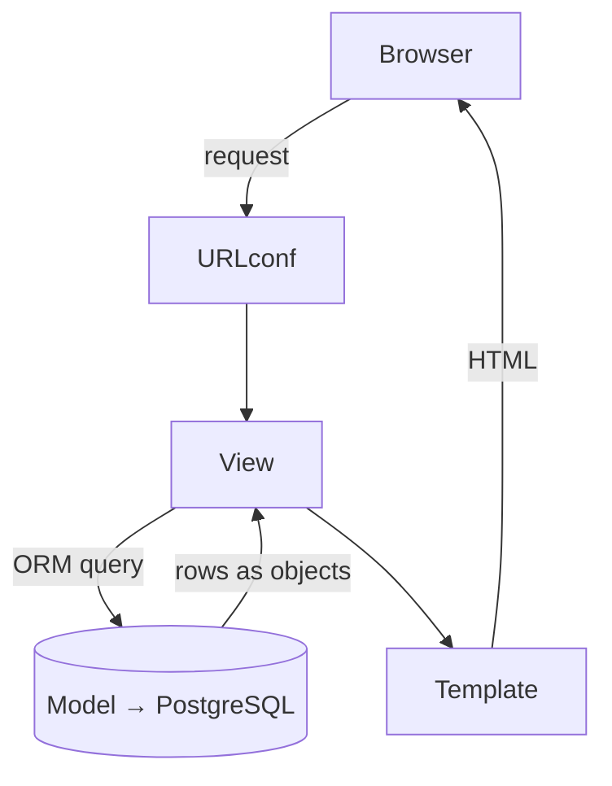
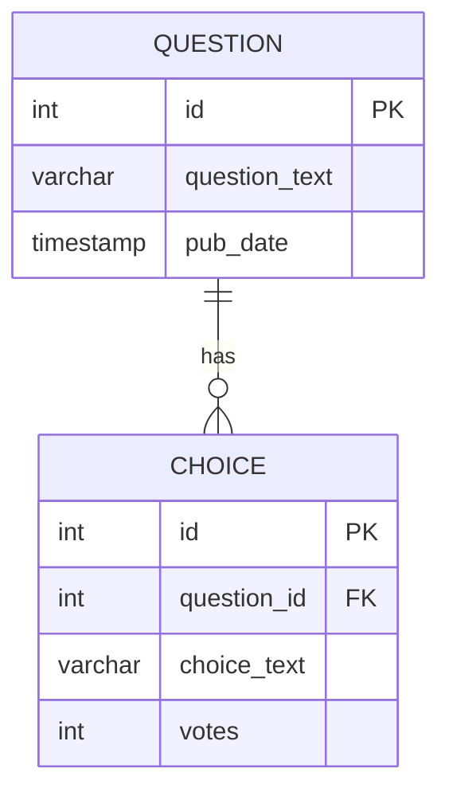
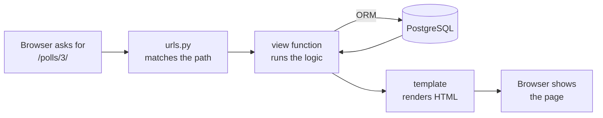

<div class="cover-kicker">Instituto Politécnico de Gestão e Tecnologia · ISLA Gaia</div>

<div class="cover-title">Django</div>

<div class="cover-rule"></div>

<div class="cover-sub">From your database to a real application.</div>

<div class="cover-meta">
<strong>Databases</strong> — LICE · 4-hour theory &amp; practice session<br/>
David Vaz · 2025/2026
</div>

---
layout: two-cols
class: text-sm
---

# Why you are in this room

You have spent a semester building a **database**:

- ER modelling — entities, relationships, cardinalities
- The relational model and the move from ER to tables
- SQL — `CREATE TABLE`, `INSERT`, `SELECT`, `JOIN`, `GROUP BY`
- Normalization — 1NF, 2NF, 3NF
- Transactions, indexes, `GRANT` / `REVOKE`

A database is excellent at **storing** and **querying** data.

::right::

<div class="mt-12"></div>

But nobody uses a database directly.

People use **applications** — a screen, a form, a button.

<div class="keyidea mt-4">
<span class="tag tag-key">Today</span>

**Django** turns the database you designed into a working
**web application** — in Python, without throwing away a single
thing you learned about SQL.
</div>

---
layout: default
---

# This is worth marks — literally

Your **Individual Project — Databases** has a section most students skip:

<div class="lab">
<span class="tag tag-lab">From your project brief — section 4</span>

**Application Integration (Bonus).** *"Up to 10% compensatory points
through optional integration with Python, Django ORM, APIs or scripts."*
</div>

<div class="mt-4"></div>

Those are **compensatory** points — they recover marks lost elsewhere.

By the end of today you will have built a small but complete Django
application on **PostgreSQL**. Doing the same on top of *your* project
database is exactly what section 4 is asking for.

<div class="note mt-4">
<span class="tag tag-note">Goal</span>
Leave today able to put a screenshot of <em>your</em> data, running in a
real app, into your project report.
</div>

---
layout: default
class: text-sm
---

# The plan — 4 hours, theory + practice

<div class="agenda">

| | Block | What we do | <span class="t">≈ time</span> |
|---|---|---|---|
| **1** | What is Django & setup | The framework, the MVT idea, a project on PostgreSQL | <span class="t">50 min</span> |
| **2** | Models & migrations | Your tables, written as Python classes | <span class="t">55 min</span> |
| | *Break* | | <span class="t">15 min</span> |
| **3** | The ORM & the Admin | Querying without SQL, a free management UI | <span class="t">55 min</span> |
| **4** | Views, URLs & templates | A public page people can actually click | <span class="t">45 min</span> |
| **5** | Wrap-up | Claiming the bonus, deployment, resources | <span class="t">15 min</span> |

</div>

Every block ends with **hands-on practice**. Slides with a red
<span class="tag tag-lab">practice</span> tag mean: stop watching, start typing.

The example is the classic Django **polls app** — a question with choices
you can vote on. Small enough to finish today, complete enough to be real.

---
layout: default
class: isla-section
---

<div class="sec-num">Part 1</div>

# What is Django?

<div class="sec-note">The framework, the MVT pattern, and a fresh project talking to PostgreSQL.</div>

---
layout: default
---

# Django in one slide

<div class="statement-isla">
A high-level Python web framework — <em>"the web framework for
perfectionists with deadlines."</em>
</div>

<div class="mt-4"></div>

- Released **2005**, built at a newspaper that shipped on tight deadlines
- Maintained by the non-profit **Django Software Foundation**
- *Batteries included* — ORM, admin, auth, forms, templates, security all in the box
- Powers Instagram, Spotify back-ends, Mozilla, NASA, and a great deal of the web

<div class="keyidea mt-4">
<span class="tag tag-key">The part that matters to you</span>
Django's <strong>ORM</strong> (Object–Relational Mapper) lets you describe
tables as Python classes and query them as Python objects — while Django
writes the SQL underneath.
</div>

---
layout: default
class: text-sm
---

# A short history — and why "5.2"

| Version | Year | Brought |
|---|---|---|
| 1.0 | 2008 | ORM, the admin, stable API |
| 1.7 | 2014 | **Migrations** — versioned schema changes |
| 2.2 / 3.2 / 4.2 | 2019–23 | LTS releases, async support |
| **5.2** | **2025** | **LTS — what we use today** |

<div class="note mt-4">
<span class="tag tag-52">Django 5.2 LTS</span>
<strong>Long-Term Support:</strong> security fixes until ~2028. Runs on
Python 3.10–3.13. New in 5.2: <strong>composite primary keys</strong>, a
<code>shell</code> that auto-imports your models, and friendlier form rendering.
</div>

Pin it explicitly so your project is reproducible:

```text
# requirements.txt
Django>=5.2,<5.3
psycopg[binary]>=3.2
```

---
layout: two-cols
class: text-sm
---

# How Django is organised — MVT

Django splits an application into three responsibilities:

<v-clicks>

- **Model** — the data. One class per table. *This is where your database lives.*
- **View** — the logic. Takes a request, fetches data, decides what to send back.
- **Template** — the page. HTML with small placeholders for data.

</v-clicks>

::right::

<div class="mt-14"></div>



<div class="small muted mt-2">
You met MVC in theory — Django's <strong>MVT</strong> is the same idea.
The "controller" is Django itself, routing requests for you.
</div>

---
layout: default
---

# The one idea to take home

<div class="grid grid-cols-2 gap-4 mt-2">
<div class="panel sql">

#### What you wrote in SQL

```sql
CREATE TABLE question (
    id          SERIAL PRIMARY KEY,
    question_text VARCHAR(200) NOT NULL,
    pub_date    TIMESTAMP NOT NULL
);
```

</div>
<div class="panel dj">

#### What you write in Django

```python
class Question(models.Model):
    question_text = models.CharField(
        max_length=200)
    pub_date = models.DateTimeField(
        "date published")
```

</div>
</div>

<div class="keyidea mt-4">
<span class="tag tag-key">A class is a table. An attribute is a column. An object is a row.</span>
Django generates the <code>CREATE TABLE</code> for you — and the
<code>INSERT</code>, <code>SELECT</code>, <code>UPDATE</code> and <code>DELETE</code> later on.
</div>

---
layout: default
class: text-sm
---

# Setting up — the tools

You need three things. You already have the third.

<v-clicks>

1. **Python 3.12+** — check with `python --version`
2. **A virtual environment** — an isolated box for this project's packages,
   so versions never clash between projects
3. **PostgreSQL** — the database you have used all semester

</v-clicks>

<div v-click class="mt-3">

```bash
# 1 — create and activate an isolated environment
python -m venv .venv
source .venv/bin/activate        # Windows: .venv\Scripts\activate

# 2 — install Django 5.2 and the PostgreSQL driver
pip install "django>=5.2,<5.3" "psycopg[binary]"
```

</div>

<div v-click class="note mt-2 small">
<span class="tag tag-note">psycopg</span>
<code>psycopg</code> is the Python ↔ PostgreSQL driver — the same kind of
connector you used with <code>psycopg</code> directly in the databases lab.
Django sits on top of it.
</div>

---
layout: default
class: text-sm
---

# Creating the project

```bash
django-admin startproject mysite     # create the project
cd mysite
python manage.py startapp polls      # create an app inside it
```

This is the layout Django gives you:

```text
mysite/
├── manage.py            ← your command-line entry point
├── mysite/
│   ├── settings.py      ← configuration (database lives here)
│   ├── urls.py          ← the site's URL map
│   └── wsgi.py / asgi.py
└── polls/               ← the app we will fill in today
    ├── models.py        ← tables
    ├── views.py         ← logic
    └── admin.py         ← admin registration
```

<div class="small muted mt-2">
<strong>Project</strong> = the whole site. <strong>App</strong> = one feature
inside it. A project can hold many apps; an app can be reused across projects.
</div>

---
layout: default
class: text-sm
---

# Pointing Django at PostgreSQL

In `mysite/settings.py`, replace the default `DATABASES` block:

```python {all|2|3-9}
DATABASES = {
    "default": {
        "ENGINE": "django.db.backends.postgresql",
        "NAME": "polls_db",
        "USER": "polls_user",
        "PASSWORD": "polls_pw",
        "HOST": "localhost",
        "PORT": "5432",
    }
}
```

First create the database itself — ordinary SQL you already know:

```sql
CREATE DATABASE polls_db;
CREATE USER polls_user WITH PASSWORD 'polls_pw';
GRANT ALL PRIVILEGES ON DATABASE polls_db TO polls_user;
```

---
layout: default
---

# First run — the rocket

```bash
python manage.py migrate      # create Django's own built-in tables
python manage.py runserver    # start the development server
```

Open **http://127.0.0.1:8000/** — you should see Django's welcome page
with a small rocket. That means: Python ✓, Django ✓, PostgreSQL ✓.

<div class="note mt-3">
<span class="tag tag-note">What just happened</span>
<code>migrate</code> created the tables Django needs for sessions, users
and the admin — <em>inside your PostgreSQL database</em>. Open it in pgAdmin
or <code>psql</code> and you will see them: <code>\dt</code>.
</div>

<div class="warn mt-3">
<code>runserver</code> is for development only. Real deployment uses a
production server — one slide on that at the end.
</div>

---
layout: default
class: isla-section
---

<div class="sec-num">Practice 1</div>

# Get the project running

<div class="sec-note">10 minutes — everyone reaches the rocket.</div>

---
layout: default
class: text-sm
---

# Practice 1 — your turn

<div class="lab">
<span class="tag tag-lab">practice · 10 min</span>

Clone **`isla-db-polls`** and stay on the `main` branch (or scaffold your own):

1. Create and activate a virtual environment
2. `pip install "django>=5.2,<5.3" "psycopg[binary]"`
3. In PostgreSQL, create `polls_db` + a user, and `GRANT` access
4. Fill in the `DATABASES` block in `settings.py`
5. `python manage.py migrate`
6. `python manage.py runserver` → open the browser → **find the rocket**
</div>

<div class="note mt-3">
<span class="tag tag-note">Stuck?</span>
A red error page is Django <em>helping</em> you — read the last line first.
"role does not exist" or "password authentication failed" → check step 3.
</div>

---
layout: default
class: isla-section
---

<div class="sec-num">Part 2</div>

# Models &amp; Migrations

<div class="sec-note">Your tables — written once, as Python classes — and how they reach PostgreSQL.</div>

---
layout: default
class: text-sm
---

# The polls data model

Two tables. You would draw this ER diagram in your sleep by now:



One **question** has many **choices** — a classic one-to-many relationship.
Let's write it as Django models.

---
layout: default
class: text-sm
---

# `polls/models.py`

```python {all|3-5|7-8|10-13|15-16}
from django.db import models


class Question(models.Model):
    question_text = models.CharField(max_length=200)
    pub_date = models.DateTimeField("date published")

    def __str__(self):
        return self.question_text


class Choice(models.Model):
    question = models.ForeignKey(Question, on_delete=models.CASCADE)
    choice_text = models.CharField(max_length=200)
    votes = models.IntegerField(default=0)

    def __str__(self):
        return self.choice_text
```

<div class="small muted mt-1">
Notice what you did <em>not</em> write: no <code>id</code> column. Django adds
an auto-incrementing primary key automatically — like <code>SERIAL PRIMARY KEY</code>.
</div>

---
layout: two-cols
class: text-sm
---

# Field types ↔ SQL types

You already know the right-hand column.

| Django field | PostgreSQL type |
|---|---|
| `CharField(max_length=n)` | `VARCHAR(n)` |
| `TextField()` | `TEXT` |
| `IntegerField()` | `INTEGER` |
| `DecimalField(...)` | `NUMERIC(p,s)` |
| `BooleanField()` | `BOOLEAN` |
| `DateField()` | `DATE` |
| `DateTimeField()` | `TIMESTAMP` |
| `ForeignKey(...)` | `INTEGER` + `FOREIGN KEY` |

::right::

<div class="mt-14"></div>

<div class="keyidea">
<span class="tag tag-key">Same modelling, two notations</span>
Choosing a Django field <strong>is</strong> choosing a column type. The data
modelling skill is identical — only the syntax changes.
</div>

<div class="note mt-3 small">
<span class="tag tag-note">Tip</span>
A wrong type is a real bug: storing a price in a <code>FloatField</code> loses
cents. Use <code>DecimalField</code> — exactly as you would pick
<code>NUMERIC</code> over <code>REAL</code> in SQL.
</div>

---
layout: default
class: text-sm
---

# Constraints — the rules travel with the model

The integrity rules you enforced in DDL have a Django equivalent:

| In SQL | In Django |
|---|---|
| `NOT NULL` | `null=False` *(the default)* |
| `UNIQUE` | `unique=True` |
| `DEFAULT 0` | `default=0` |
| `CHECK (...)` | a `CheckConstraint` in `Meta.constraints` |
| `FOREIGN KEY ... ON DELETE CASCADE` | `ForeignKey(..., on_delete=models.CASCADE)` |

```python
class Choice(models.Model):
    # ...
    class Meta:
        constraints = [
            models.CheckConstraint(
                condition=models.Q(votes__gte=0),
                name="votes_non_negative",
            ),
        ]
```

<div class="small muted mt-1">
The constraint is created <em>in PostgreSQL</em> — the database still enforces it.
Django just lets you declare it next to the field it protects.
</div>

---
layout: default
---

# `on_delete` — you have to choose

A foreign key in Django **forces** you to answer: *"when the parent row is
deleted, what happens to the children?"*

| `on_delete=` | SQL meaning |
|---|---|
| `models.CASCADE` | `ON DELETE CASCADE` — delete the children too |
| `models.PROTECT` | `ON DELETE RESTRICT` — block the deletion |
| `models.SET_NULL` | `ON DELETE SET NULL` *(needs `null=True`)* |
| `models.SET_DEFAULT` | `ON DELETE SET DEFAULT` |

<div class="note mt-3">
<span class="tag tag-note">Why this is good</span>
In raw SQL, forgetting <code>ON DELETE</code> is easy and silent. Django
will not let you define a <code>ForeignKey</code> without deciding — a design
question turned into a required argument.
</div>

---
layout: default
class: text-sm
---

# Migrations — versioned schema changes

You changed `models.py`. PostgreSQL does not know yet. Two commands bridge that:

```bash
python manage.py makemigrations polls   # 1 — Django writes a migration file
python manage.py migrate                # 2 — Django runs it against PostgreSQL
```

`makemigrations` creates `polls/migrations/0001_initial.py` — a Python
description of the change. `migrate` turns it into SQL and executes it.

<div class="keyidea mt-3">
<span class="tag tag-key">Migrations = version control for your schema</span>
Instead of a folder of loose <code>.sql</code> scripts you must run in the
right order by hand, you get an ordered, replayable history Django tracks
for you. Edit a model later → <code>makemigrations</code> again → a new step.
</div>

---
layout: default
class: text-sm
---

# See the SQL — `sqlmigrate`

A migration is not magic. Ask Django to show the exact SQL it will run:

```bash
python manage.py sqlmigrate polls 0001
```

```sql
BEGIN;
CREATE TABLE "polls_question" (
    "id" bigint NOT NULL PRIMARY KEY GENERATED BY DEFAULT AS IDENTITY,
    "question_text" varchar(200) NOT NULL,
    "pub_date" timestamp with time zone NOT NULL
);
CREATE TABLE "polls_choice" (
    "id" bigint NOT NULL PRIMARY KEY GENERATED BY DEFAULT AS IDENTITY,
    "choice_text" varchar(200) NOT NULL,
    "votes" integer NOT NULL,
    "question_id" bigint NOT NULL REFERENCES "polls_question" ("id")
);
COMMIT;
```

<div class="small muted mt-1">
This is the DDL you would have written by hand — wrapped in a transaction,
exactly as you learned migrations should be.
</div>

---
layout: default
---

# What's new in 5.2 — composite primary keys

In normalization you built **junction tables** whose key is *two* columns
together. Until recently Django could not express that. Django 5.2 can:

```python
class Vote(models.Model):
    pk = models.CompositePrimaryKey("question", "voter")
    question = models.ForeignKey(Question, on_delete=models.CASCADE)
    voter = models.ForeignKey("Voter", on_delete=models.CASCADE)
```

<div class="note mt-3">
<span class="tag tag-52">Django 5.2</span>
This produces a genuine <code>PRIMARY KEY (question_id, voter_id)</code> in
PostgreSQL. We will not need it for the polls app — but for <em>your</em>
project, with many-to-many tables, it is the modern, correct way.
</div>

---
layout: default
class: isla-section
---

<div class="sec-num">Practice 2</div>

# Build the tables

<div class="sec-note">Write the models, look at the SQL, migrate, verify in PostgreSQL.</div>

---
layout: default
class: text-sm
---

# Practice 2 — your turn

<div class="lab">
<span class="tag tag-lab">practice · 15 min</span>

1. Write `Question` and `Choice` in `polls/models.py` (with `__str__`)
2. Add `"polls"` to `INSTALLED_APPS` in `settings.py`
3. `python manage.py makemigrations polls`
4. **Read the SQL:** `python manage.py sqlmigrate polls 0001`
5. `python manage.py migrate`
6. In `psql` / pgAdmin: `\dt` — find `polls_question` and `polls_choice`.
   Run `\d polls_choice` and check the foreign key is there.
</div>

<div class="note mt-3 small">
<span class="tag tag-note">Challenge</span>
Add a <code>CheckConstraint</code> so <code>votes</code> can never go negative,
then <code>makemigrations</code> again and read the new SQL.
</div>

---
layout: default
class: isla-section
---

<div class="sec-num">Part 3</div>

# The ORM &amp; the Admin

<div class="sec-note">Querying your data without writing SQL — and a free, instant management interface.</div>

---
layout: default
class: text-sm
---

# The shell — a live console for your data

```bash
python manage.py shell
```

<div class="note mb-3">
<span class="tag tag-52">Django 5.2</span>
The <code>shell</code> now <strong>auto-imports your models</strong> — no
<code>from polls.models import Question</code> needed. Just start querying.
</div>

```python
from django.utils import timezone

# INSERT INTO polls_question (...) VALUES (...)
q = Question(question_text="What is your favourite framework?",
             pub_date=timezone.now())
q.save()

q.id            # 1  — the database gave it a primary key
Question.objects.all()      # <QuerySet [<Question: What is your ...>]>
```

`Question.objects` is the **manager** — your entry point to every query
about questions.

---
layout: default
---

# `SELECT` ↔ QuerySet

<div class="grid grid-cols-2 gap-4 mt-1">
<div class="panel sql">

#### SQL

```sql
SELECT * FROM polls_question;

SELECT * FROM polls_question
WHERE question_text
      LIKE 'What%';

SELECT * FROM polls_question
ORDER BY pub_date DESC;

SELECT * FROM polls_question
WHERE id = 1;
```

</div>
<div class="panel dj">

#### Django ORM

```python
Question.objects.all()

Question.objects.filter(
    question_text__startswith="What")


Question.objects.order_by("-pub_date")


Question.objects.get(pk=1)
```

</div>
</div>

<div class="small muted mt-2">
<code>filter()</code> is <code>WHERE</code>. <code>get()</code> returns exactly
one row — or raises an error if it finds zero or many.
</div>

---
layout: default
class: text-sm
---

# Field lookups — the `WHERE` toolbox

The `__` (double underscore) introduces a **lookup** — the operator:

```python
Question.objects.filter(pub_date__year=2026)        # WHERE EXTRACT(YEAR ...) = 2026
Question.objects.filter(pub_date__gte=timezone.now())  # >=
Question.objects.filter(question_text__icontains="django")  # ILIKE '%django%'
Question.objects.exclude(question_text__startswith="What")   # WHERE NOT ...
Choice.objects.filter(votes__gt=0).count()          # SELECT COUNT(*) ...
```

| Lookup | SQL |
|---|---|
| `__gt` `__gte` `__lt` `__lte` | `>` `>=` `<` `<=` |
| `__contains` / `__icontains` | `LIKE` / `ILIKE` |
| `__in` | `IN (...)` |
| `__isnull` | `IS NULL` |
| `__year` `__month` `__date` | date parts |

---
layout: default
class: text-sm
---

# Following relationships — no `JOIN` to write

The foreign key works in **both directions**, as Python attributes:

```python
c = Choice.objects.first()
c.question                  # the parent Question object — Django JOINs for you
c.question.pub_date         # walk straight through to its columns

q = Question.objects.get(pk=1)
q.choice_set.all()          # every Choice pointing at this question
q.choice_set.count()        # SELECT COUNT(*) FROM polls_choice WHERE question_id = 1
q.choice_set.create(choice_text="Django", votes=0)   # INSERT, already linked
```

<div class="keyidea mt-3">
<span class="tag tag-key">The JOIN is still happening</span>
Django writes the <code>JOIN</code> against the foreign key you defined. You
navigate objects; the ORM produces the SQL. (For big lists,
<code>select_related()</code> fetches the parent in the <em>same</em> query —
worth knowing for your project.)
</div>

---
layout: default
class: text-sm
---

# Aggregation ↔ `GROUP BY`

Counting votes per question — `annotate()` is `GROUP BY`:

<div class="grid grid-cols-2 gap-4 mt-1">
<div class="panel sql">

#### SQL

```sql
SELECT q.id,
       SUM(c.votes) AS total
FROM polls_question q
JOIN polls_choice c
  ON c.question_id = q.id
GROUP BY q.id;
```

</div>
<div class="panel dj">

#### Django ORM

```python
from django.db.models import Sum

Question.objects.annotate(
    total=Sum("choice__votes")
)
```

</div>
</div>

```python
# aggregate() collapses to a single number — like SELECT COUNT(*)
Choice.objects.aggregate(Sum("votes"))     # {'votes__sum': 42}
```

<div class="small muted mt-1">
<code>annotate()</code> = one number <em>per group / row</em>.
<code>aggregate()</code> = one number for the <em>whole</em> query.
</div>

---
layout: default
---

# `UPDATE` and `DELETE`

```python
# UPDATE one row
q = Question.objects.get(pk=1)
q.question_text = "Edited question"
q.save()

# UPDATE many rows in a single SQL statement
Question.objects.filter(pub_date__year=2024).update(question_text="archived")

# DELETE
Choice.objects.filter(votes=0).delete()
```

<div class="warn mt-4">
<span class="tag tag-note">Careful — same as raw SQL</span>
<code>Question.objects.all().delete()</code> empties the table. A
<code>QuerySet</code> with no <code>filter()</code> is a statement with no
<code>WHERE</code>. The ORM will not save you from that.
</div>

---
layout: default
class: text-sm
---

# The Admin — a management UI you did not build

You spent weeks choosing pgAdmin or `psql` to inspect tables. Django ships
a **web admin** — generated entirely from your models.

```python
# polls/admin.py
from django.contrib import admin
from .models import Question, Choice

admin.site.register(Question)
admin.site.register(Choice)
```

```bash
python manage.py createsuperuser     # create your login
python manage.py runserver           # then open /admin/
```

<div class="keyidea mt-3">
<span class="tag tag-key">Three lines = a full CRUD interface</span>
Create, read, update, delete — search, filter, pagination — for every model,
with login and permissions. No SQL, no HTML.
</div>

---
layout: default
class: text-sm
---

# Making the Admin yours

The default admin is plain. A small class makes it genuinely useful:

```python {all|5|6|7|8-10|11}
from django.contrib import admin
from .models import Question, Choice

class ChoiceInline(admin.TabularInline):     # edit choices ON the question page
    model = Choice
    extra = 2

@admin.register(Question)
class QuestionAdmin(admin.ModelAdmin):
    list_display = ("question_text", "pub_date")   # columns in the list
    list_filter = ("pub_date",)                    # a sidebar filter
    search_fields = ("question_text",)             # a search box
    inlines = [ChoiceInline]
```

<div class="note mt-2 small">
<span class="tag tag-note">For your project</span>
This <em>is</em> a valid "application integration": register your project's
models, take a screenshot of the working back-office, explain it in the report.
</div>

---
layout: default
class: isla-section
---

<div class="sec-num">Practice 3</div>

# Query and manage your data

<div class="sec-note">Use the shell, then bring the Admin to life.</div>

---
layout: default
class: text-sm
---

# Practice 3 — your turn

<div class="lab">
<span class="tag tag-lab">practice · 20 min</span>

**A — in the shell** (`python manage.py shell`):
1. Create 2 questions and several choices for each (`choice_set.create(...)`)
2. `Question.objects.all()` · `filter(...)` · `order_by("-pub_date")`
3. Count votes per question with `annotate(Sum("choice__votes"))`

**B — the Admin:**
4. `createsuperuser`, then register both models in `polls/admin.py`
5. Add a `QuestionAdmin` with `list_display`, `list_filter`, `search_fields`
   and a `ChoiceInline`
6. `runserver` → `/admin/` → add a question *through the web page*
</div>

---
layout: default
class: isla-section
---

<div class="sec-num">Part 4</div>

# Views, URLs &amp; Templates

<div class="sec-note">A public page — something a visitor can open and click, not just an admin login.</div>

---
layout: default
class: text-sm
---

# The request → response cycle



Three files do the work:

- **`urls.py`** — which address runs which view
- **`views.py`** — fetch data with the ORM, hand it to a template
- **a template** — HTML with placeholders

---
layout: default
class: text-sm
---

# URLs — the address book

```python
# polls/urls.py  (new file)
from django.urls import path
from . import views

app_name = "polls"
urlpatterns = [
    path("", views.index, name="index"),
    path("<int:question_id>/", views.detail, name="detail"),
    path("<int:question_id>/results/", views.results, name="results"),
    path("<int:question_id>/vote/", views.vote, name="vote"),
]
```

```python
# mysite/urls.py — include the app's URLs
from django.urls import include, path
urlpatterns = [
    path("admin/", admin.site.urls),
    path("polls/", include("polls.urls")),
]
```

<div class="small muted mt-1">
<code>&lt;int:question_id&gt;</code> captures a number from the URL and passes
it to the view. <code>name=</code> lets you refer to a URL without hard-coding it.
</div>

---
layout: default
class: text-sm
---

# Views — logic, in Python

```python
# polls/views.py
from django.shortcuts import get_object_or_404, render
from .models import Question

def index(request):
    latest = Question.objects.order_by("-pub_date")[:5]
    return render(request, "polls/index.html",
                  {"latest_question_list": latest})

def detail(request, question_id):
    question = get_object_or_404(Question, pk=question_id)
    return render(request, "polls/detail.html", {"question": question})
```

A view receives a `request`, uses the **ORM** to get data, and calls
`render()` — *template + data → HTML response*.

<div class="small muted mt-1">
<code>get_object_or_404()</code>: fetch the row, or show a clean 404 page if
it does not exist — instead of crashing.
</div>

---
layout: default
class: text-sm
---

# Templates — HTML with placeholders

```html
<!-- polls/templates/polls/index.html -->
<h1>Latest questions</h1>
<ul>
  
    <li>
      <a href="">
        {{ question.question_text }}
      </a>
    </li>
  
</ul>
```

The four pieces of template syntax you need today:

```jinja
{{ variable }}                      {# print a value          #}
 ...   {# loop                 #}
 ...     {# condition            #}
  {# build a link by name  #}
```

---
layout: default
class: text-sm
---

# The vote view — and a transaction lesson

```python {all|8|9-10|11}
from django.db.models import F
from django.http import HttpResponseRedirect
from django.urls import reverse

def vote(request, question_id):
    question = get_object_or_404(Question, pk=question_id)
    choice = question.choice_set.get(pk=request.POST["choice"])
    choice.votes = F("votes") + 1          # ← not  choice.votes + 1
    choice.save()
    return HttpResponseRedirect(
        reverse("polls:results", args=(question.id,)))
```

<div class="keyidea mt-2">
<span class="tag tag-key">Remember ACID and lost updates?</span>
<code>F("votes") + 1</code> compiles to <code>SET votes = votes + 1</code> —
the increment happens <em>inside</em> PostgreSQL, atomically. Two visitors
voting at once cannot overwrite each other. Reading into Python first would
risk exactly the lost-update problem from your transactions lesson.
</div>

---
layout: default
class: isla-section
---

<div class="sec-num">Practice 4</div>

# A page people can use

<div class="sec-note">Wire up the index, the detail page, and voting.</div>

---
layout: default
class: text-sm
---

# Practice 4 — your turn

<div class="lab">
<span class="tag tag-lab">practice · 20 min</span>

1. Create `polls/urls.py` and `include()` it from `mysite/urls.py`
2. Write the `index` and `detail` views
3. Create `polls/templates/polls/index.html` and `detail.html`
4. The detail page shows the question + a `<form>` of radio-button choices
5. Write the `vote` view using `F("votes") + 1`
6. Open `/polls/`, click a question, **cast a vote**, watch the count rise
</div>

<div class="note mt-3 small">
<span class="tag tag-note">Done early?</span>
Add a <code>results.html</code> page showing each choice and its vote total.
The full solution is on the <code>solution</code> branch.
</div>

---
layout: default
class: isla-section
---

<div class="sec-num">Part 5</div>

# Wrap-up — claiming the bonus

<div class="sec-note">What you built, how it maps to your project, and where to go next.</div>

---
layout: default
class: text-sm
---

# What you built today

<div class="grid grid-cols-2 gap-3 mt-2">
<div class="panel dj">

#### The pieces

- A Django 5.2 project on **PostgreSQL**
- Two **models** → two tables
- **Migrations** for the schema
- The **ORM** instead of hand-written SQL
- The **Admin** — a free back-office
- **Views + templates** — a usable page

</div>
<div class="panel sql">

#### The mapping to remember

- model `class` → `CREATE TABLE`
- migration → versioned DDL
- `objects.filter()` → `SELECT … WHERE`
- `annotate()` → `GROUP BY`
- `F()` increment → safe `UPDATE`
- `ForeignKey` → `FOREIGN KEY`

</div>
</div>

<div class="keyidea mt-3">
You did not replace your database knowledge — you put a Python application
<em>on top of it</em>.
</div>

---
layout: default
class: text-sm
---

# Turning this into bonus marks

Your project brief offers **up to 10%** for application integration.
Three levels — pick the one you have time for:

<v-clicks>

1. **Minimum** — load your project schema into Django models, register them
   in the Admin, screenshot the working back-office. *Already worth points.*
2. **Solid** — add the ORM: a small script or shell session that runs your
   key queries through Django instead of raw SQL.
3. **Strong** — one or two real pages (a list + a detail view) that show your
   data to a visitor.

</v-clicks>

<div v-click class="note mt-3 small">
<span class="tag tag-note">In the report</span>
Add a short "Application Integration" section: what you used Django for, a
screenshot, and one paragraph on how the ORM relates to your SQL. Be ready
to answer questions on it in the defense — the brief says knowledge must be global.
</div>

---
layout: default
class: text-sm
---

# Beyond today — and deployment

The polls app is the start. For a real project you would also meet:

- **Forms** — validating user input safely
- **Class-based views** — less code for standard list/detail pages
- **`select_related` / `prefetch_related`** — avoiding slow query patterns
- **Tests** — Django creates a throwaway test database for you
- **Authentication** — `login`, permissions, groups

<div class="note mt-3 small">
<span class="tag tag-note">Deployment, in one line</span>
For production: a real server (Gunicorn/uvicorn) behind nginx,
<code>DEBUG = False</code>, and your PostgreSQL database. Anywhere Python
runs, Django runs.
</div>

---
layout: default
class: text-sm
---

# Resources

- **Official tutorial** — the polls app, in full — `docs.djangoproject.com/en/5.2/intro/`
- **Django 5.2 documentation** — `docs.djangoproject.com/en/5.2/`
- **The ORM / making queries** — `docs.djangoproject.com/en/5.2/topics/db/queries/`
- **Today's code** — `github.com/davidmgvaz/isla-db-polls` — starter on `main`, solution on the `solution` branch

<div class="note mt-4">
<span class="tag tag-note">Class theme</span>
Everything today used the polls example. The exercise that earns marks is
doing the same on <em>your</em> e-commerce project database — customers,
products, orders. Same steps, your tables.
</div>

---
layout: default
class: isla-cover
---


<div class="cover-title" style="font-size:2.4rem">Questions?</div>

<div class="cover-rule"></div>

<div class="cover-sub">Now go put your database to work.</div>

<div class="cover-meta">
David Vaz · Databases · ISLA Gaia<br/>
<strong>Django</strong> — from your database to a real application
</div>
