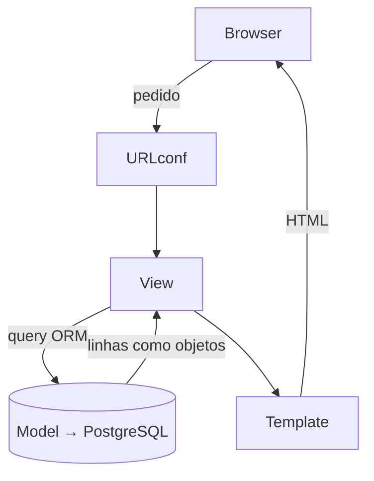

<div class="cover-kicker">Instituto Politécnico de Gestão e Tecnologia · ISLA Gaia</div>

<div class="cover-title">Django</div>

<div class="cover-rule"></div>

<div class="cover-sub">A camada aplicacional sobre a tua base de dados.</div>

<div class="cover-meta">
<strong>Programação de Bases de Dados</strong> — LEI · Sessão de 4h, teoria e prática<br/>
David Vaz · 2025/2026
</div>

---
layout: two-cols
class: text-sm
---

# Onde é que vocês estão

Um semestre inteiro a programar **dentro** da base de dados:

- SQL avançado — subqueries, CTEs, `CASE`, **window functions**
- Constraints e integridade — `CHECK`, domínios, chaves
- Transações e concorrência — ACID, isolamento, *locks*
- **PL/pgSQL** — funções, procedures
- **Triggers** — auditoria, automatização
- Segurança — *roles*, `GRANT`/`REVOKE`, SQL injection
- Performance — índices, `EXPLAIN ANALYZE`

::right::

<div class="mt-8"></div>

Sabem fazer o PostgreSQL trabalhar.

O que falta ver: **onde acaba a base de dados e começa a aplicação**.

<div class="keyidea mt-4">
<span class="tag tag-key">Hoje</span>

O **Django** é a camada aplicacional. Não substitui o que sabem de SQL —
liga-o a uma aplicação real e obriga a decidir, conscientemente, que lógica
vive na BD e que lógica vive no código.
</div>

---
layout: default
---

# Isto encaixa no plano — e vale nota

A **Aula 12** do plano de PBD chama-se *"Integração com aplicações
(prepared statements, BD como backend)"*. É hoje.

E o **Trabalho Prático** tem uma componente que quase ninguém aproveita:

<div class="lab">
<span class="tag tag-lab">Enunciado do TP — secção 4</span>

**Integração com aplicações.** *"Componente opcional e compensatória …
pode contribuir até **20 pontos percentuais** para compensar pontos
perdidos noutras componentes."* Exemplos aceites: *"pequena aplicação ou
script … simulação de API … camada service-like … prepared statements …
demonstração clara da fronteira entre lógica da base de dados e lógica
aplicacional."*

</div>

<div class="note mt-3 small">
<span class="tag tag-note">Objetivo da sessão</span>
Sair daqui capaz de pôr uma camada Django por cima do schema do vosso TP —
e de justificar, no relatório e na defesa, onde traçaram a fronteira.
</div>

---
layout: default
class: text-sm
---

# O plano — 4 horas, teoria e prática

<div class="agenda">

| | Bloco | O que fazemos | <span class="t">≈ tempo</span> |
|---|---|---|---|
| **1** | Django e o ORM | A framework, o padrão MVT, o ORM como gerador de SQL | <span class="t">50 min</span> |
| **2** | Modelos, migrações, `inspectdb` | Tabelas em Python; integrar um schema que já existe | <span class="t">50 min</span> |
| | *Intervalo* | | <span class="t">15 min</span> |
| **3** | A fronteira BD ↔ aplicação | ORM avançado, transações, SQL bruto, funções, *signals* vs *triggers* | <span class="t">65 min</span> |
| **4** | Admin e API (DRF) | Backoffice grátis; uma API REST | <span class="t">45 min</span> |
| **5** | Fecho | O bónus, o relatório, recursos | <span class="t">15 min</span> |

</div>

Cada bloco termina com **prática**. Slides com a etiqueta vermelha
<span class="tag tag-lab">prática</span> querem dizer: parar de ver, começar a escrever.

O exemplo é a **polls app** do tutorial oficial — uma pergunta com opções
votáveis. Pequena, mas suficiente para tudo o que precisamos.

---
layout: default
class: isla-section
---

<div class="sec-num">Parte 1</div>

# Django e o ORM

<div class="sec-note">A framework, o padrão MVT, e o ORM visto como aquilo que realmente é — um gerador de SQL.</div>

---
layout: default
---

# Django num slide

<div class="statement-isla">
Uma framework web de alto nível, em Python — <em>"the web framework for
perfectionists with deadlines."</em>
</div>

<div class="mt-4"></div>

- Lançada em **2005**, mantida pela **Django Software Foundation**
- *Batteries included* — ORM, admin, autenticação, formulários, segurança
- **5.2 LTS (2025)** — suporte de segurança até ~2028, Python 3.10–3.13
- Suporta Instagram, partes da Spotify, Mozilla, NASA

<div class="keyidea mt-4">
<span class="tag tag-key">A peça central para esta UC</span>
O <strong>ORM</strong> (Object–Relational Mapper) descreve tabelas como
classes Python e consulta-as como objetos. Mas, ao contrário do que parece,
não esconde o SQL — <strong>gera-o</strong>. E hoje vamos sempre olhar para o SQL gerado.
</div>

---
layout: two-cols
class: text-sm
---

# O padrão MVT

O Django separa a aplicação em três responsabilidades:

<v-clicks>

- **Model** — os dados. Uma classe por tabela.
- **View** — a lógica. Recebe um pedido, consulta dados, decide a resposta.
- **Template** — a apresentação. HTML com marcadores.

</v-clicks>

<div v-click class="small muted mt-3">
É o MVC que conhecem. O "controlador" é o próprio Django, a encaminhar pedidos.
</div>

::right::

<div class="mt-14"></div>



<div class="note mt-2 small">
<span class="tag tag-note">Nota</span>
A camada de dados (Model) é a única que toca no PostgreSQL. É aí que se
decide o que é feito em SQL e o que sobe para Python.
</div>

---
layout: default
class: text-sm
---

# Preparar o ambiente

```bash
# ambiente isolado
python -m venv .venv
source .venv/bin/activate            # Windows: .venv\Scripts\activate

# Django 5.2 + driver PostgreSQL
pip install "django>=5.2,<5.3" "psycopg[binary]"

# criar projeto e app
django-admin startproject mysite
cd mysite
python manage.py startapp polls
```

<div class="note mt-2 small">
<span class="tag tag-note">psycopg 3</span>
O <code>psycopg</code> é o driver Python ↔ PostgreSQL — o mesmo tipo de
ligação que usam num cliente. O Django assenta em cima dele; o Django 5.2
suporta plenamente o <code>psycopg</code> 3.
</div>

Estrutura: `manage.py` (entrada CLI), `mysite/settings.py` (configuração),
`mysite/urls.py` (mapa de URLs), `polls/` (a app).

---
layout: default
class: text-sm
---

# Ligar ao PostgreSQL

`mysite/settings.py`:

```python
DATABASES = {
    "default": {
        "ENGINE": "django.db.backends.postgresql",
        "NAME": "polls_db",
        "USER": "polls_app",      # ← reparem neste utilizador
        "PASSWORD": "polls_pw",
        "HOST": "localhost",
        "PORT": "5432",
    }
}
```

<div class="keyidea mt-2 small">
<span class="tag tag-key">Já aqui há uma decisão de fronteira</span>
O Django liga-se com <strong>um</strong> <em>role</em>. Esse <em>role</em>
não precisa de ser <code>SUPERUSER</code> — dêem-lhe só os
<code>GRANT</code> de que a aplicação precisa. A vossa Aula 9 (segurança)
aplica-se na mesma: a aplicação é apenas mais um cliente da base de dados.
</div>

---
layout: default
class: text-sm
---

# O ORM não é magia — é SQL

A regra de ouro desta sessão: **sempre que usarem o ORM, saibam ver o SQL.**

```python
qs = Question.objects.filter(question_text__icontains="django")

print(qs.query)          # o SELECT exato que vai ser enviado
#  SELECT "polls_question"."id", ... FROM "polls_question"
#  WHERE "polls_question"."question_text" ILIKE %django%

from django.db import connection
print(connection.queries)    # todas as queries da sessão (com DEBUG=True)

qs.explain(analyze=True)     # EXECUTA EXPLAIN ANALYZE — o que já conhecem
```

<div class="note mt-2 small">
<span class="tag tag-note">Ferramentas</span>
<code>python manage.py dbshell</code> abre o <code>psql</code> ligado à BD do
projeto. <code>sqlmigrate</code> mostra o DDL de uma migração. Nunca estão
"às escuras".
</div>

---
layout: default
class: isla-section
---

<div class="sec-num">Prática 1</div>

# Pôr o projeto a correr

<div class="sec-note">10 minutos — todos chegam ao foguetão.</div>

---
layout: default
class: text-sm
---

# Prática 1 — mãos à obra

<div class="lab">
<span class="tag tag-lab">prática · 10 min</span>

A partir do projeto **`pbd-polls-starter`** (ou criando o vosso):

1. Criar e ativar o ambiente virtual
2. `pip install "django>=5.2,<5.3" "psycopg[binary]"`
3. No PostgreSQL: criar `polls_db` e um *role* de aplicação, com `GRANT`
4. Preencher o bloco `DATABASES` no `settings.py`
5. `python manage.py migrate` → `python manage.py runserver`
6. Abrir o browser → encontrar o **foguetão**
7. `python manage.py dbshell` → `\dt` → ver as tabelas que o Django criou
</div>

<div class="note mt-2 small">
<span class="tag tag-note">Reparem</span>
O <code>migrate</code> criou tabelas (<code>auth_user</code>,
<code>django_session</code>, …) <em>dentro</em> do PostgreSQL. O Django é
só mais uma aplicação a usar a vossa base de dados.
</div>

---
layout: default
class: isla-section
---

<div class="sec-num">Parte 2</div>

# Modelos, Migrações e `inspectdb`

<div class="sec-note">Tabelas escritas em Python — e como integrar um schema SQL que já existe.</div>

---
layout: default
class: text-sm
---

# `polls/models.py`

```python {all|4-6|9-11|13-14}
from django.db import models


class Question(models.Model):
    question_text = models.CharField(max_length=200)
    pub_date = models.DateTimeField("data de publicação")

    def __str__(self):
        return self.question_text


class Choice(models.Model):
    question = models.ForeignKey(Question, on_delete=models.CASCADE)
    choice_text = models.CharField(max_length=200)
    votes = models.IntegerField(default=0)

    def __str__(self):
        return self.choice_text
```

<div class="small muted mt-1">
Não há coluna <code>id</code> escrita: o Django acrescenta uma chave primária
<code>bigint … GENERATED BY DEFAULT AS IDENTITY</code> automaticamente.
</div>

---
layout: default
class: text-sm
---

# Campos, tipos e constraints

| Django | PostgreSQL |
|---|---|
| `CharField` / `TextField` | `varchar(n)` / `text` |
| `IntegerField` / `BigIntegerField` | `integer` / `bigint` |
| `DecimalField` | `numeric(p,s)` |
| `DateTimeField` | `timestamp with time zone` |
| `ForeignKey(..., on_delete=...)` | `FK` + `ON DELETE …` |
| `unique=True` / `UniqueConstraint` | `UNIQUE` |
| `CheckConstraint(condition=Q(...))` | `CHECK (...)` |
| `default=` / `db_default=` | *default* da aplicação / `DEFAULT` na coluna |
| `GeneratedField` | `GENERATED ALWAYS AS (...) STORED` |

<div class="note mt-2 small">
<span class="tag tag-52">Django 5.0+ / 5.2</span>
<code>db_default</code> põe o <code>DEFAULT</code> na própria coluna (não só
na aplicação). <code>GeneratedField</code> cria uma coluna gerada. Continuam
a controlar a integridade ao nível da BD — só que declarada junto do campo.
</div>

---
layout: default
class: text-sm
---

# Migrações — DDL versionado

```bash
python manage.py makemigrations polls   # gera polls/migrations/0001_initial.py
python manage.py sqlmigrate polls 0001  # mostra o SQL exato
python manage.py migrate                # executa contra o PostgreSQL
```

```sql
BEGIN;
CREATE TABLE "polls_question" (
    "id" bigint NOT NULL PRIMARY KEY GENERATED BY DEFAULT AS IDENTITY,
    "question_text" varchar(200) NOT NULL,
    "pub_date" timestamp with time zone NOT NULL
);
-- ...
COMMIT;
```

<div class="keyidea mt-2 small">
<span class="tag tag-key">Migração = controlo de versões do schema</span>
Em vez de uma pasta de <code>.sql</code> soltos que alguém tem de correr na
ordem certa, têm um histórico ordenado, reversível e rastreado. Cada
alteração ao modelo gera um novo passo. Tudo dentro de uma transação.
</div>

---
layout: default
class: text-sm
---

# Quando o DDL não nasce do modelo — `RunSQL`

Nem tudo se exprime num modelo: um índice parcial, uma `VIEW`, uma extensão.
A migração aceita SQL à mão — e mantém-no versionado e reversível:

```python
from django.db import migrations

class Migration(migrations.Migration):
    dependencies = [("polls", "0001_initial")]
    operations = [
        migrations.RunSQL(
            sql="CREATE INDEX idx_choice_votes "
                "ON polls_choice (votes DESC);",
            reverse_sql="DROP INDEX idx_choice_votes;",
        ),
        # migrations.RunPython(...)  para migração de dados
    ]
```

<div class="small muted mt-1">
<code>RunSQL</code> para DDL; <code>RunPython</code> para migração de dados.
O vosso conhecimento de SQL não desaparece — ganha um sítio versionado.
</div>

---
layout: default
class: text-sm
---

# `inspectdb` — partir do schema que já têm

O TP exige que escrevam o schema em SQL. Não precisam de o reescrever como
modelos à mão — o Django lê a base de dados e gera os modelos:

```bash
python manage.py inspectdb > polls/models_legado.py
python manage.py inspectdb polls_choice        # só uma tabela
```

```python
class PollsChoice(models.Model):
    question = models.ForeignKey("PollsQuestion", models.CASCADE)
    choice_text = models.CharField(max_length=200)
    votes = models.IntegerField()

    class Meta:
        managed = False        # ← o Django NÃO cria/altera/apaga esta tabela
        db_table = "polls_choice"
```

<div class="keyidea mt-2 small">
<span class="tag tag-key">A fronteira, na prática</span>
<code>managed = False</code>: o schema é gerido por <em>vós</em>, em SQL; o
Django só o consulta. <code>managed = True</code>: o Django gere o schema
via migrações. Escolhem deliberadamente quem manda em cada tabela.
</div>

---
layout: default
---

# Novidade do 5.2 — chaves primárias compostas

As tabelas de associação que normalizaram têm chave de **duas colunas**.
Até há pouco o ORM não o exprimia. O Django 5.2 exprime:

```python
class Voto(models.Model):
    pk = models.CompositePrimaryKey("question", "eleitor")
    question = models.ForeignKey(Question, on_delete=models.CASCADE)
    eleitor = models.ForeignKey("Eleitor", on_delete=models.CASCADE)
```

<div class="note mt-3">
<span class="tag tag-52">Django 5.2</span>
Gera um <code>PRIMARY KEY (question_id, eleitor_id)</code> verdadeiro.
Ressalva: ainda não funciona no admin nem como alvo de <em>foreign key</em>.
Para chaves compostas como alvo de FK, mantenham uma chave substituta.
</div>

---
layout: default
class: isla-section
---

<div class="sec-num">Prática 2</div>

# Modelos, SQL e `inspectdb`

<div class="sec-note">Escrever os modelos, ver o DDL, e gerar modelos a partir de uma tabela existente.</div>

---
layout: default
class: text-sm
---

# Prática 2 — mãos à obra

<div class="lab">
<span class="tag tag-lab">prática · 15 min</span>

1. Escrever `Question` e `Choice` em `polls/models.py`
2. Acrescentar `"polls"` a `INSTALLED_APPS`
3. `makemigrations polls` → **ler** `sqlmigrate polls 0001` → `migrate`
4. Acrescentar uma 2.ª migração com `RunSQL` que cria um índice em
   `polls_choice (votes DESC)`; correr e confirmar com `\di` no `dbshell`
5. Criar uma tabela à mão no `psql` (`CREATE TABLE …`) e correr
   `inspectdb` sobre ela — observar o `managed = False`
</div>

<div class="note mt-2 small">
<span class="tag tag-note">Para o TP</span>
O passo 5 é o caminho recomendado: schema do TP escrito em SQL → modelos
gerados → camada Django por cima.
</div>

---
layout: default
class: isla-section
---

<div class="sec-num">Parte 3</div>

# A fronteira BD ↔ aplicação

<div class="sec-note">ORM avançado, transações, SQL bruto, funções PL/pgSQL, e <em>signals</em> vs <em>triggers</em>. O coração da sessão.</div>

---
layout: default
class: text-sm
---

# QuerySets — preguiçosos e encadeáveis

Um `QuerySet` **não toca na base de dados** até ser preciso. Pode ser
construído por partes:

```python
qs = Question.objects.all()                    # 0 queries ainda
qs = qs.filter(pub_date__year=2026)            # 0 queries
qs = qs.exclude(question_text__startswith="?") # 0 queries
qs = qs.order_by("-pub_date")[:10]             # 0 queries — LIMIT 10

list(qs)        # AQUI — uma única query é enviada
```

<div class="keyidea mt-2 small">
<span class="tag tag-key">Avaliação preguiçosa</span>
Cada método devolve um novo <code>QuerySet</code>; o SQL só é construído e
executado no momento da iteração, <code>len()</code>, <code>list()</code> ou
fatia indexada. Encadear filtros é compor um único <code>SELECT</code> — não
são várias queries.
</div>

---
layout: default
---

# `select_related` / `prefetch_related` — o N+1

<div class="grid grid-cols-2 gap-4 mt-1">
<div class="panel sql">

#### O problema N+1

```python
for c in Choice.objects.all():
    print(c.question.question_text)
# 1 query para as choices
# + 1 query POR CADA choice
```

</div>
<div class="panel dj">

#### A correção

```python
choices = Choice.objects.select_related(
    "question"          # JOIN — 1 só query
)
for c in choices:
    print(c.question.question_text)
```

</div>
</div>

<div class="note mt-3 small">
<span class="tag tag-note">Conhecem isto</span>
<code>select_related</code> faz <code>JOIN</code> (relações
*to-one*). <code>prefetch_related</code> faz uma 2.ª query e junta em
Python (relações *to-many*). Confirmem com <code>connection.queries</code>
ou <code>.explain()</code> — o N+1 é a causa nº 1 de aplicações Django lentas.
</div>

---
layout: default
class: text-sm
---

# Window functions — no ORM

Deram window functions na Aula 3. O ORM tem-nas:

<div class="grid grid-cols-2 gap-4 mt-1">
<div class="panel sql">

#### SQL

```sql
SELECT *,
  RANK() OVER (
    PARTITION BY question_id
    ORDER BY votes DESC
  ) AS posicao
FROM polls_choice;
```

</div>
<div class="panel dj">

#### Django ORM

```python
from django.db.models import Window, F
from django.db.models.functions import Rank

Choice.objects.annotate(
    posicao=Window(
        expression=Rank(),
        partition_by=[F("question_id")],
        order_by=F("votes").desc(),
    ),
)
```

</div>
</div>

<div class="small muted mt-2">
Também <code>RowNumber</code>, <code>DenseRank</code>, <code>Lag</code>,
<code>Lead</code>, <code>Ntile</code>. Mesma semântica do SQL — outra notação.
</div>

---
layout: default
class: text-sm
---

# Transações e concorrência

```python {all|1|2-3|4-6}
from django.db import transaction

with transaction.atomic():                       # BEGIN ... COMMIT
    choice = (Choice.objects
              .select_for_update()               # SELECT ... FOR UPDATE
              .get(pk=pk))
    choice.votes = F("votes") + 1                 # UPDATE ... SET v = v + 1
    choice.save()
```

<div class="keyidea mt-2 small">
<span class="tag tag-key">A vossa Aula 5, em Python</span>
<code>atomic()</code> = bloco transacional. <code>select_for_update()</code>
adquire o *lock* de linha — protege contra a *lost update*.
<code>F("votes") + 1</code> faz o incremento <em>dentro</em> do PostgreSQL,
sem ler o valor para Python. O nível de isolamento configura-se no
<code>DATABASES["OPTIONS"]["isolation_level"]</code>.
</div>

<div class="small muted mt-1">
Decisão de fronteira: a garantia de atomicidade é da BD; o Django apenas
delimita a transação.
</div>

---
layout: default
class: text-sm
---

# Quando *não* usar o ORM — SQL bruto

O ORM cobre 95% dos casos. Para os outros há saída — com parâmetros:

```python
# .raw() — SQL livre, devolve objetos do modelo
Question.objects.raw(
    "SELECT * FROM polls_question WHERE pub_date > %s", [data]
)

# cursor — controlo total (queries que não mapeiam num modelo)
from django.db import connection
with connection.cursor() as cur:
    cur.execute(
        "SELECT question_id, SUM(votes) FROM polls_choice "
        "GROUP BY question_id HAVING SUM(votes) > %s", [100]
    )
    linhas = cur.fetchall()
```

<div class="warn mt-2 small">
<span class="tag tag-note">Aula 9 — SQL injection</span>
<code>%s</code> é um <em>placeholder</em> — o driver envia o valor à parte
(prepared statement). <strong>Nunca</strong> construam SQL com f-strings ou
<code>+</code>. O ORM parametriza por omissão; em SQL bruto, a
responsabilidade é vossa.
</div>

---
layout: default
class: text-sm
---

# Chamar funções e procedures PL/pgSQL

Escreveram a lógica em PL/pgSQL? O Django chama-a — não a reescrevam:

```python
from django.db import connection

# uma function RETURNS TABLE
with connection.cursor() as cur:
    cur.execute("SELECT * FROM total_votos_por_pergunta(%s)", [qid])
    resultado = cur.fetchall()

# uma procedure (CALL)
with connection.cursor() as cur:
    cur.callproc("arquivar_perguntas_antigas", [cutoff_date])
```

<div class="keyidea mt-2 small">
<span class="tag tag-key">A fronteira que o enunciado pede</span>
Lógica de conjuntos, relatórios e regras de integridade pesadas → funções e
procedures na BD (rápidas, reutilizáveis por qualquer cliente). Orquestração,
HTTP, validação de formulários, apresentação → Django. Uma <em>"camada
service-like"</em> é exatamente isto: funções Python finas que invocam SQL.
</div>

---
layout: default
class: text-sm
---

# *Signals* vs *Triggers*

Os *signals* do Django **parecem** triggers — mas não correm onde os triggers correm.

```python
from django.db.models.signals import post_save
from django.dispatch import receiver

@receiver(post_save, sender=Choice)
def ao_gravar_choice(sender, instance, created, **kwargs):
    if created:
        notificar_servico_externo(instance)   # corre no PROCESSO Python
```

<div class="grid grid-cols-2 gap-3 mt-2 text-sm">
<div class="panel sql">

#### Trigger (PostgreSQL)

Corre **na BD**. Vale para *qualquer* cliente — Django, `psql`, outra app.
Ideal para **integridade** e **auditoria** que têm de ser garantidas.

</div>
<div class="panel dj">

#### Signal (Django)

Corre **na aplicação**. Só dispara para escritas feitas *via ORM* — um
`UPDATE` em `psql` não o aciona. Ideal para **efeitos da aplicação** (emails, caches).

</div>
</div>

<div class="warn mt-2 small">
Auditoria que tem de ser inviolável → <strong>trigger</strong>. Nunca um signal.
</div>

---
layout: default
class: isla-section
---

<div class="sec-num">Prática 3</div>

# A fronteira, na prática

<div class="sec-note">Ver o SQL gerado, uma window function, um lock, e chamar uma função PL/pgSQL.</div>

---
layout: default
class: text-sm
---

# Prática 3 — mãos à obra

<div class="lab">
<span class="tag tag-lab">prática · 20 min</span>

No `python manage.py shell` (com `DEBUG=True`):

1. Construir um `QuerySet` encadeado; imprimir `.query`; só depois `list()`
2. Provocar um N+1 e corrigi-lo com `select_related` — comparar
   `len(connection.queries)` antes e depois
3. Escrever a window function `Rank()` por `question` e ler o `.query`
4. Num bloco `transaction.atomic()`, usar `select_for_update()` + `F()`
5. Criar uma `FUNCTION` PL/pgSQL simples no `dbshell` e chamá-la do Django
   com `connection.cursor()`
</div>

<div class="note mt-2 small">
<span class="tag tag-note">Solução</span>
Tudo isto está resolvido em <code>pbd-polls-solution</code>.
</div>

---
layout: default
class: isla-section
---

<div class="sec-num">Parte 4</div>

# Admin e API (DRF)

<div class="sec-note">Um backoffice gerado a partir dos modelos — e uma API REST para a "simulação de API" do enunciado.</div>

---
layout: default
class: text-sm
---

# O Admin — um backoffice grátis

Três linhas dão um CRUD completo, com autenticação e permissões:

```python
# polls/admin.py
from django.contrib import admin
from .models import Question, Choice

class ChoiceInline(admin.TabularInline):
    model = Choice
    extra = 2

@admin.register(Question)
class QuestionAdmin(admin.ModelAdmin):
    list_display = ("question_text", "pub_date")
    list_filter = ("pub_date",)
    search_fields = ("question_text",)
    inlines = [ChoiceInline]
```

<div class="note mt-2 small">
<span class="tag tag-note">Para o TP</span>
<code>createsuperuser</code> → <code>/admin/</code>. É um backoffice
defensável: o staff gere dados sem tocar em SQL. Funciona com
<code>managed = False</code> — ou seja, sobre o schema do vosso TP.
</div>

---
layout: default
class: text-sm
---

# Views, URLs e o voto

Rápido — vocês já leem isto. O essencial é o **voto**:

```python
# polls/views.py
from django.db.models import F
from django.shortcuts import get_object_or_404, render
from .models import Choice, Question

def detail(request, question_id):
    question = get_object_or_404(Question, pk=question_id)
    return render(request, "polls/detail.html", {"question": question})

def vote(request, question_id):
    choice = get_object_or_404(Choice, pk=request.POST["choice"])
    choice.votes = F("votes") + 1     # UPDATE atómico — sem race condition
    choice.save()
    return redirect("polls:results", question_id=question_id)
```

<div class="small muted mt-1">
O <code>urls.py</code> da app mapeia cada <code>path()</code> para uma view
(<code>name="vote"</code> permite referir o URL sem o escrever à mão). Os
templates são HTML com marcadores de variável e blocos de ciclo — sintaxe
idêntica à do tutorial oficial.
</div>

---
layout: default
class: text-sm
---

# Django REST Framework — uma API

O enunciado aceita *"simulação de API"*. Com DRF é uma API a sério:

```bash
pip install djangorestframework
```

```python
# serializers.py — o que entra/sai como JSON
from rest_framework import serializers
from .models import Question

class QuestionSerializer(serializers.ModelSerializer):
    class Meta:
        model = Question
        fields = ["id", "question_text", "pub_date"]
```

```python
# views.py — um ViewSet dá list/create/retrieve/update/delete
from rest_framework import viewsets

class QuestionViewSet(viewsets.ModelViewSet):
    queryset = Question.objects.all()
    serializer_class = QuestionSerializer
```

---
layout: default
class: text-sm
---

# DRF — ligar o *router*

```python
# mysite/urls.py
from rest_framework.routers import DefaultRouter
from polls.views import QuestionViewSet

router = DefaultRouter()
router.register("questions", QuestionViewSet)

urlpatterns = [
    path("admin/", admin.site.urls),
    path("api/", include(router.urls)),
]
```

Resultado, sem mais código:

| Método + URL | Faz |
|---|---|
| `GET /api/questions/` | lista todas as perguntas (JSON) |
| `POST /api/questions/` | cria uma pergunta |
| `GET /api/questions/3/` | obtém uma pergunta |
| `PUT` / `PATCH` / `DELETE /api/questions/3/` | atualiza / apaga |

<div class="small muted mt-1">
O DRF traz ainda uma interface web navegável em <code>/api/</code> — ótima para a defesa.
</div>

---
layout: default
class: isla-section
---

<div class="sec-num">Prática 4</div>

# Backoffice e API

<div class="sec-note">Pôr o Admin a funcionar e expor um endpoint REST.</div>

---
layout: default
class: text-sm
---

# Prática 4 — mãos à obra

<div class="lab">
<span class="tag tag-lab">prática · 20 min</span>

1. `createsuperuser`; registar `Question` e `Choice` no `admin.py` com
   `QuestionAdmin` (`list_display`, `list_filter`, `inlines`)
2. `runserver` → `/admin/` → criar uma pergunta com opções pela web
3. `pip install djangorestframework` e acrescentar `rest_framework` a
   `INSTALLED_APPS`
4. Criar `QuestionSerializer` + `QuestionViewSet` e registar o *router*
5. Abrir `/api/questions/` no browser; fazer um `POST` pela API navegável
</div>

<div class="note mt-2 small">
<span class="tag tag-note">Quem acabar cedo</span>
Acrescentem ao serializer as <code>choices</code> aninhadas (nested
serializer) — solução em <code>pbd-polls-solution</code>.
</div>

---
layout: default
class: isla-section
---

<div class="sec-num">Parte 5</div>

# Fecho — ganhar o bónus

<div class="sec-note">O que construíram, como mapeia ao TP, e para onde ir a seguir.</div>

---
layout: default
class: text-sm
---

# O que construíram hoje

<div class="grid grid-cols-2 gap-3 mt-2">
<div class="panel dj">

#### As peças

- Projeto Django 5.2 sobre **PostgreSQL**
- Modelos, migrações, **`inspectdb`**
- ORM — e o **SQL** por trás dele
- Transações, *locks*, window functions
- SQL bruto e funções **PL/pgSQL** a partir do Django
- *Signals* vs *triggers*
- Admin + uma **API DRF**

</div>
<div class="panel sql">

#### A fronteira

- Integridade, regras de conjuntos, auditoria → **BD**
- Orquestração, HTTP, validação, apresentação → **Django**
- Relatórios pesados → funções/`VIEW`s, chamadas pelo ORM
- `managed = False` → o schema é vosso; o Django consulta

</div>
</div>

<div class="keyidea mt-2 small">
Não trocaram SQL por ORM. Ganharam um sítio para a lógica que <em>não</em> é da base de dados.
</div>

---
layout: default
class: text-sm
---

# Transformar isto em pontos no TP

A componente de integração vale **até 20 pontos percentuais
compensatórios**. Três níveis — escolham conforme o tempo:

<v-clicks>

1. **Base** — `inspectdb` sobre o schema do TP, modelos `managed = False`,
   Admin registado. Backoffice funcional, defensável.
2. **Sólido** — uma *camada service-like*: funções Python finas que invocam
   as vossas funções/procedures PL/pgSQL com *prepared statements*.
3. **Forte** — uma API DRF sobre o schema, ou uma página que mostre dados.

</v-clicks>

<div v-click class="note mt-3 small">
<span class="tag tag-note">No relatório</span>
Secção "Integração com aplicações": o que o Django faz, o que fica em SQL,
e <strong>porquê</strong> — a tal <em>"demonstração clara da fronteira"</em>.
É a fronteira, bem justificada, que distingue a nota.
</div>

---
layout: default
class: text-sm
---

# Recursos

- **Tutorial oficial** (polls, completo) — `docs.djangoproject.com/en/5.2/intro/`
- **Documentação 5.2** — `docs.djangoproject.com/en/5.2/`
- **ORM / fazer queries** — `docs.djangoproject.com/en/5.2/topics/db/`
- **Executar SQL diretamente** — `.../topics/db/sql/`
- **Django REST Framework** — `www.django-rest-framework.org`
- **Código de hoje** — `pbd-polls-starter` e `pbd-polls-solution`

<div class="note mt-3 small">
<span class="tag tag-52">Django 5.2</span>
LTS até ~2028 · Python 3.10–3.13 · chaves primárias compostas ·
<code>shell</code> com auto-import de modelos · <code>db_default</code> e
<code>GeneratedField</code> para integridade ao nível da coluna.
</div>

---
layout: default
class: isla-cover
---


<div class="cover-title" style="font-size:2.4rem">Perguntas?</div>

<div class="cover-rule"></div>

<div class="cover-sub">A base de dados é vossa. Agora dêem-lhe uma aplicação.</div>

<div class="cover-meta">
David Vaz · Programação de Bases de Dados · ISLA Gaia<br/>
<strong>Django</strong> — a camada aplicacional sobre a base de dados
</div>
